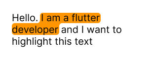
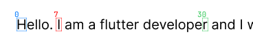
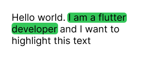
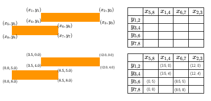
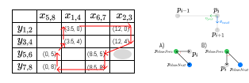

# Soft Text Outline Algorithm (Flutter/Dart)

Below is a breakdown of an algorithm that draws a neat highlight "plate" under selected text, even when the text wraps to multiple lines.  
The sample implementation in this project uses Flutter, but the core idea is not tied to Dart.

---

## Where to find this in code

- Selection rectangle extraction: `calculateHighlightBoundsPerLine()` in `lib/highlighter/shared/get_position_per_line.dart`.
- Special multiline case normalization: `_buildHighlightBounds()` in `lib/highlighter/text_with_highlight.dart`.
- Matrix-based contour construction: `_buildContourPoints()` in `lib/highlighter/helpers/highlighted_text.dart`.
- Corner rounding and cross product logic: `_roundContourCorners()` in `lib/highlighter/helpers/highlighted_text.dart`.
- Final path + text rendering on top: `HighlightContourPainter.paint()` and `HighlightedSegmentsText.build()`.

---

## What we want to achieve

- Highlight should follow the text contour, not just a plain rectangle.
- Line transitions should look smooth, without broken "steps."
- Corners should be rounded so the shape looks natural.



---

## 1) Get geometry for the selected fragment

First, we turn the segment array into a single `TextSpan`, lay it out with `TextPainter`, and compute the character range for the target segment.



```dart
final textPainter = TextPainter(
  text: TextSpan(children: inlineSpans),
  textDirection: textDirection,
)..layout(maxWidth: maxWidth);

int selectionStart = 0;
for (int i = 0; i < segmentIndex; i++) {
  selectionStart += textSegments[i].length;
}
final int selectionEnd = selectionStart + textSegments[segmentIndex].length;
```

The index math is straightforward:

$$
s_i = \sum_{k=0}^{i-1} |t_k|,\quad
e_i = s_i + |t_i|
$$

where:

- \(t_i\) is the i-th text segment,
- \(s_i\) is the segment start in the full string,
- \(e_i\) is the segment end.

Then we use `getBoxesForSelection`:

```dart
final selectionBoxes = textPainter.getBoxesForSelection(
  TextSelection(baseOffset: selectionStart, extentOffset: selectionEnd),
);
```

If boxes exist, we convert them to `HighlightBounds`.  
If not (rare edge case), we take start/end caret positions and build a fallback contour.

---

## 2) Normalize the special "shifted first box" case

Sometimes the first box can end up further right than expected relative to the next line.  
In this project, this is fixed with a simple heuristic: split one group into two.



```dart
if (boundsGroup.length > 1 &&
    boundsGroup[0].startX > (boundsGroup[1].endX - 10)) {
  normalizedBoundsGroups.add([boundsGroup[0]]);
  boundsGroup.removeAt(0);
  normalizedBoundsGroups.add(boundsGroup);
}
```

In practice, this removes visual artifacts at multiline transitions.

---

## 3) Build the contour using a point matrix

The idea: collect all box corner points into a coordinate "table" and walk its perimeter clockwise.



### 3.1 Unique X and Y axes

Take all rectangle `x` and `y` values, keep unique ones, and sort:

$$
X = \mathrm{sort}\left(\mathrm{unique}(\{x_{left}, x_{right}\})\right),\quad
Y = \mathrm{sort}\left(\mathrm{unique}(\{y_{top}, y_{bottom}\})\right)
$$


In code:

```dart
final uniqueXList = uniqueX.toList()..sort();
final uniqueYList = uniqueY.toList()..sort();

final List<List<Offset?>> matrix = List.generate(
  uniqueYList.length,
  (index) => List.generate(uniqueXList.length, (index) => null),
);
```

### 3.2 Fill the matrix

For each point in each box, find its `x` and `y` index, then place it into `matrix[yIndex][xIndex]`.

### 3.3 Clockwise perimeter traversal

Contour is collected in this order:

1. Top edge: left to right.
2. Right edge: top to bottom.
3. Bottom edge: right to left.
4. Left edge: bottom to top.

Formally:

$$
P = T \,\Vert\, R \,\Vert\, B \,\Vert\, L
$$

where \(T, R, B, L\) are point lists for each side, and \(\Vert\) is concatenation.

### 3.4 Align transitions on side edges

When neighboring points on the right/left side have different `dx`, vertical transition may look skewed.  
So we average `dy` in pairs:

$$
\Delta = \frac{|y_{i+1} - y_i|}{2}
$$

For the right side:

$$
y_i' = y_i + \Delta,\quad y_{i+1}' = y_{i+1} - \Delta
$$

For the left side (mirrored):

$$
y_i' = y_i - \Delta,\quad y_{i+1}' = y_{i+1} + \Delta
$$

### 3.5 Remove unnecessary points

- Remove duplicates.
- Remove points that lie on one straight line:
  - if \(x_{i-1}=x_i=x_{i+1}\), the point is redundant;
  - if \(y_{i-1}=y_i=y_{i+1}\), the point is redundant.

After this cleanup, mostly corner vertices remain.

---

## 4) Round corners using vectors



For each vertex \(p_i\), take neighboring points \(p_{i-1}\) and \(p_{i+1}\), then compute two unit vectors:

$$
\hat{v}_{prev} = \frac{p_{i-1} - p_i}{\|p_{i-1} - p_i\|},\quad
\hat{v}_{next} = \frac{p_{i+1} - p_i}{\|p_{i+1} - p_i\|}
$$

Radius is capped by a base value and local geometry:

$$
r = \min\left(r_0,\ \frac{\|p_{i+1} - p_i\|}{2}\right),\quad r_0 = 6
$$

Then create two points near the corner:

$$
p_{closePrev} = p_i + r \cdot \hat{v}_{prev},\quad
p_{closeNext} = p_i + r \cdot \hat{v}_{next}
$$

In code:

```dart
final prevVector = (prevPoint - point).normalized();
final nextVector = (nextPoint - point).normalized();
final radius = min(6.0, (nextPoint - point).length / 2);

final pointCloseToNext = (nextVector * radius) + point;
final pointCloseToPrev = (prevVector * radius) + point;
```

---

## 5) Determine arc direction via cross product

Now we need to choose arc direction for `arcToPoint`: clockwise or counterclockwise.

Take:

$$
a = p_i - p_{closePrev},\quad
b = p_{closeNext} - p_{closePrev}
$$

2D cross product (z-component):

$$
b \times a = b_x a_y - b_y a_x
$$

If the sign is positive, treat the turn as "clockwise" (in contour's internal geometry), otherwise the opposite.

```dart
final vectorToCurrent = point - pointCloseToPrev;
final vectorToNext = pointCloseToNext - pointCloseToPrev;
final crossProduct = vectorToNext.cross(vectorToCurrent);
final isClockwise = crossProduct > 0;
```

> Important: in Flutter screen coordinates, the \(Y\) axis points downward. Because of that, the code inverts this flag when passing it to `arcToPoint` (`clockwise: ... != true`) so the visible arc bends correctly.

---

## 6) Draw the final path

After corner rounding, we have pairs of points:  
`(corner entry point, direction flag)` and `(corner exit point, null)`.

Then:

1. `moveTo` the first point.
2. Draw the first arc.
3. In a loop: `lineTo` to next corner -> `arcToPoint`.
4. `close()` and `drawPath()`.

```dart
path.moveTo(roundedContourPoints.first.$1.dx, roundedContourPoints.first.$1.dy);
drawArc(0);
for (int i = 2; i < roundedContourPoints.length; i = i + 2) {
  path.lineTo(roundedContourPoints[i].$1.dx, roundedContourPoints[i].$1.dy);
  drawArc(i);
}
path.close();
canvas.drawPath(path, Paint()..color = highlightColor);
```

---

## 7) Draw text on top of the contour

Contour and text are layered in a `Stack`: first `CustomPaint`, then `RichText`.

```dart
Stack(
  children: [
    CustomPaint(...),
    IgnorePointer(
      ignoring: true,
      child: RichText(text: ...),
    ),
  ],
)
```

This gives us a clean colored shape under the exact same text.

---

## Quick algorithm recap

1. Get `TextBox` rectangles for the selected text segment.
2. Normalize special multiline transition cases.
3. Build a matrix from unique `x/y` values and traverse its perimeter clockwise.
4. Remove duplicates and collinear points.
5. Round corners via unit vectors and a clamped radius.
6. Use cross product sign to choose arc direction.
7. Draw the path and place text on top.

---

## Possible next improvements

- Separate regular and highlighted text styles without metric drift.
- Cache computed contours to avoid rebuilding on every `build`.
- Improve merging of "special" groups to preserve more semantic continuity.

